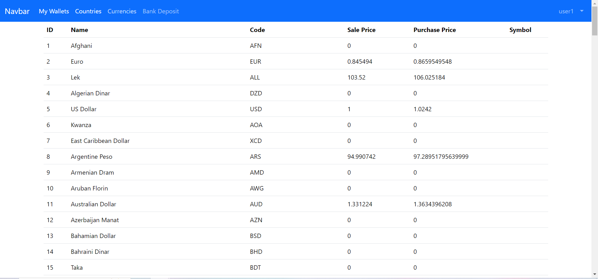

<H2  style="text-align:center"> Advanced Security: Keycloak-Spring for Microservices and Angular</H2>
<H2>- ebank-service secured</H2>
<H3>- Get Access Token</H3>

<H3>- Get Data By Access Token </H3>

<H2>- Frontend Application</H2>

<H2>- Services That Can the User Visit Without Login</H2>
<H3>- Countries</H3>

<H3>- Currencies</H3>

<H2>- Services That Can't the User Visit Without Login</H2>
<H3>- Bank Deposit</H3>

<H3>- My Wallet</H3>

